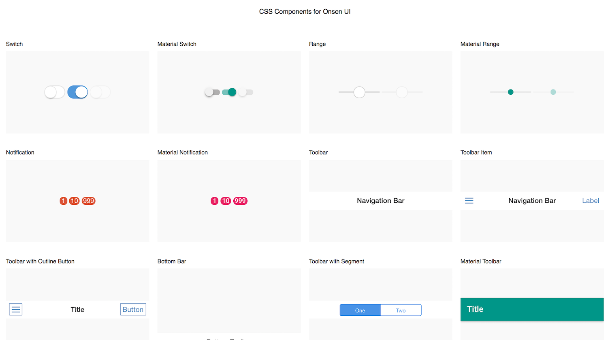

# Onsen CSS Components

Onsen CSS Components is CSS components for Cordova Apps.

## How to Build

This CSS components is built by PostCSS + cssnext. You can build with following commands.

```
$ yarn install --pure-lockfile
$ gulp build
```

## How to Customize Components



Execute the following command. When this command is executed, a preview of the CSS components is displayed in the browser.

```
$ yarn install --pure-lockfile
$ gulp serve
```

When you edit the cssnext files under the `src` directory, the cssnext files is automatically built into the CSS and the browser is reloaded. The built CSS file is located in `./build/onsen-css-components.css`.

To customize theme colors, you can edit `./src/theme.css`. This file contains CSS variables for the theme colors.

If you want to customize components' details, you can edit `./src/components/*.css`. These files contain actual rules for all CSS components. But these files may be changed significantly by minor version release.

